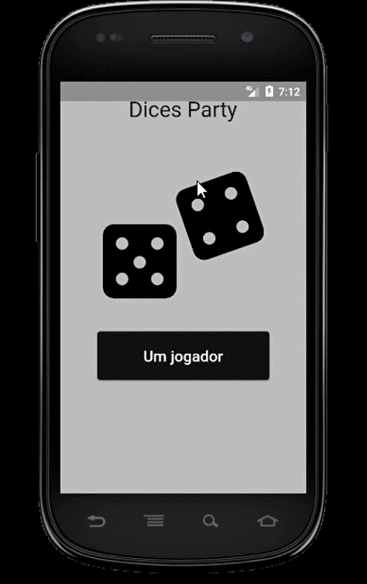

# Dices Party :game_die:

Esse projeto tinha como objetivo principal ser um atividade a entregue na matéria de desenvolvimento mobile, da Faculdade Impacta de Tecnologia.
Decidi, para por em prática, dar continuidade ao projeto para ir testando meus conhecimentos de ao decorrer do que for aprendendo em Flutter.

## Notas de Versão

### - Versão inicial 0.1
- Melhorado o Layout da Aplicação
- Desenvolvida a lógica para gerar os números aleatórios

### - Versão inicial 0.2
- Foi adicionado imagens para representar os dados
- Nova dinâmica da lógica por trás do jogo reduzindo linha de código

### -  Versão 1.0
- Acho que dá pra chamar de versão 1.0 né?
- Nessa versão do programa trago melhorias como:
  * Validação do input do usuário
  * Pontuação Humano vs. Computador
  * Redução de algumas linhas de código com a criação de Widgets
  * Melhora no visual para torna-lo mais acessível
  * Melhora no design para caber em aparelhos com telas menores

